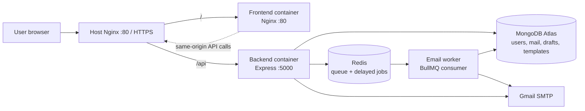
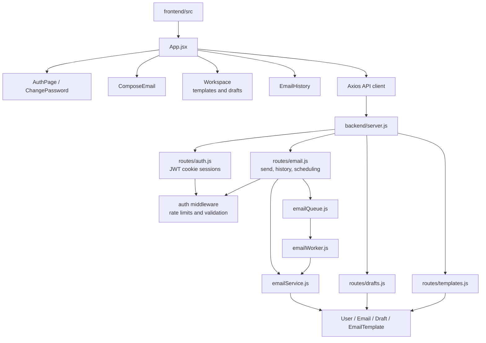
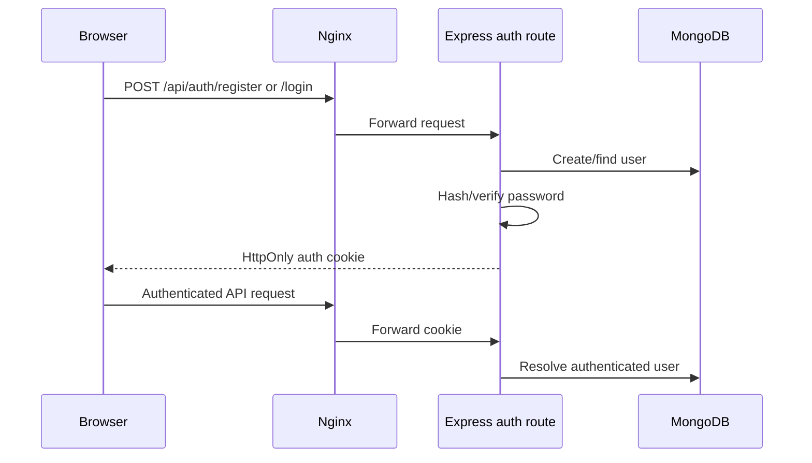
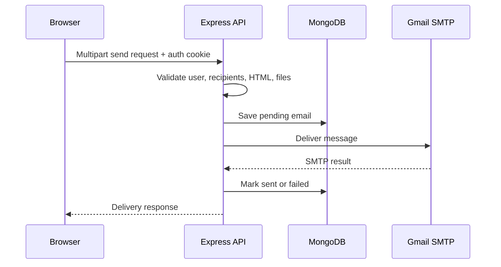
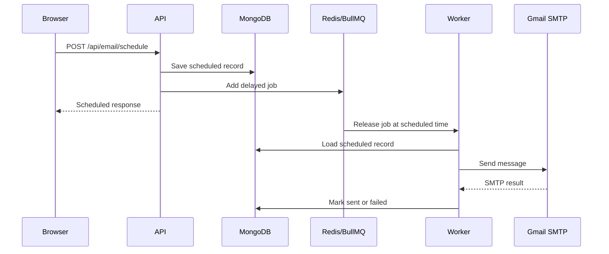
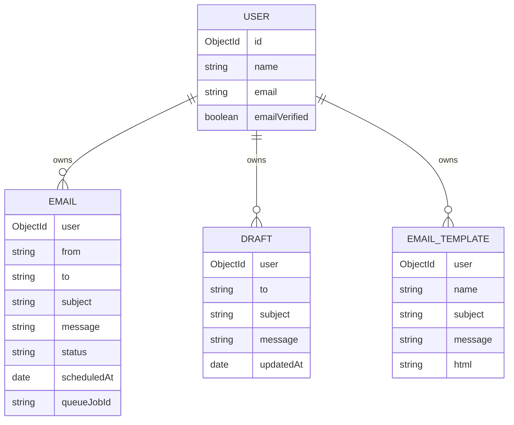

# Quick Mail Architecture

Quick Mail is a React/Vite email workspace backed by an Express API,
MongoDB, Gmail SMTP, Redis, and a BullMQ delivery worker. In the recommended
deployment, host Nginx is the only public HTTP entry point and Docker exposes
the application services on loopback ports.

## System context



## Repository architecture



## Runtime services

| Service | Container | Purpose | Loopback port |
|---|---|---|---:|
| Host Nginx | system service | Public reverse proxy | 80/443 |
| Frontend | `mern-smtp-frontend` | Static React/Vite assets | 3000 |
| Backend | `mern-smtp-backend` | Express API and direct sends | 5000 |
| Worker | `mern-smtp-worker` | Queued and scheduled delivery | none |
| Redis | `mern-smtp-redis` | BullMQ queue and delayed jobs | 6379 |
| MongoDB | `mern-smtp-mongodb` | Optional local database profile | 27017 |

MongoDB Atlas is the active production database. The local MongoDB service is
only enabled with the `local-db` Compose profile.

All Docker services use `restart: "no"` so this application does not return
after a reboot unless explicitly started. Redis and the worker are part of
the full queue deployment and should be started together with the backend.

## Request flows

### Authentication



### Direct email send



### Scheduled email



## Security boundaries

- Nginx is the public boundary; Docker ports bind to `127.0.0.1`.
- Authentication uses HttpOnly SameSite cookies. Bearer compatibility remains
  available for API clients where configured.
- User-owned data queries always include the authenticated user ID.
- Password reset and verification tokens are stored hashed and expire.
- Auth and send routes are rate-limited.
- Custom HTML is sanitized before persistence and delivery.
- Uploads are restricted by count, per-file size, total size, and MIME type.
- Attachment files are deleted after direct or queued delivery attempts.
- Secrets remain in ignored environment files and are never embedded in Vite
  variables.

## Data model



## Deployment modes

### Docker + host Nginx + Atlas

```bash
sudo docker compose up -d --build redis backend worker frontend
sudo docker compose ps
curl http://localhost/api/health
curl http://localhost/api/email/health
```

Use this as the primary local-production and cloud deployment mode.

### PM2 + host Nginx + Atlas

Run the backend and worker with `ecosystem.config.cjs`, build the frontend,
and let Nginx serve the generated assets. Do not run the PM2 backend and
Docker backend simultaneously on port 5000.

### Docker + local MongoDB

Set `DB_SOURCE=local`, then run:

```bash
sudo docker compose --profile local-db up -d --build redis mongodb backend worker frontend
```

This mode is for testing and development, not the default production setup.

## Operational commands

```bash
# Status and logs
sudo docker compose ps
sudo docker compose logs --tail=200 backend worker

# Rebuild after source changes
sudo docker compose up -d --build redis backend worker frontend

# Stop Quick Mail but leave host Nginx running
sudo docker compose down

# Validate configuration
docker compose config --quiet
sudo nginx -t
```

## Backup and recovery

- Enable MongoDB Atlas automated backups and test restoration periodically.
- Back up Redis only when queue recovery requirements justify it; queued jobs
  should be safely retryable.
- Back up uploaded attachments or migrate them to S3-compatible object
  storage before public production use.
- Never use `docker compose down -v` on a host whose named volumes contain
  data that has not been backed up.
- Rotate MongoDB, Gmail, Redis, and JWT secrets after exposure.

## Validation

```bash
find backend -name '*.js' -print0 | xargs -0 -n1 node --check
(cd frontend && npm run lint && npm run build)
docker compose config --quiet
git diff --check
```

The operational deployment guide remains in `DEPLOYMENT.md`, Docker-specific
commands remain in `DOCKER.md`, and this file is the architecture reference.
