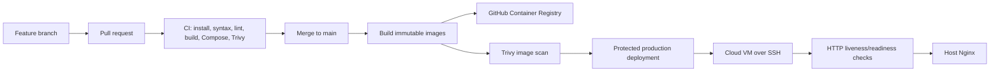

# Quick Mail DevOps and CI/CD Guide

This document defines the recommended GitHub Actions and Docker deployment
workflow for Quick Mail.

## Delivery model



The repository uses two workflows:

- `.github/workflows/ci.yml`: runs on pull requests and pushes to `feature` or
  `main`; it validates source and scans the repository.
- `.github/workflows/deploy.yml`: runs after a successful `main` CI workflow or
  manually; it publishes/deploys an immutable Git SHA image through GHCR.

Production uses `docker-compose.yml` plus `docker-compose.prod.yml`. The
production override replaces local builds with GHCR images while retaining
health checks, Redis, the worker, loopback-only ports, and named volumes.

## Branching and promotion

1. Develop on `feature` or another short-lived branch.
2. Open a pull request into `main`.
3. Require the `CI / validate` check to pass.
4. Merge only after review.
5. CI builds and scans images for the resulting `main` commit.
6. Deployment runs against the protected `production` environment.
7. The deploy job pulls the exact commit SHA, not a mutable `latest` tag.

Do not deploy directly from a developer workstation.

## GitHub configuration

### Repository settings

Enable:

- Actions.
- Packages: read/write for workflows.
- Branch protection for `main`.
- Required status check: `CI / validate`.
- At least one required pull-request review.
- Conversation resolution before merge.

### Production environment

Create a GitHub environment named `production`. Add required reviewers if
manual approval is desired before deployment.

Add these environment secrets:

| Secret | Purpose |
|---|---|
| `DEPLOY_HOST` | Public DNS name or IP of the VM |
| `DEPLOY_USER` | Restricted SSH deployment user |
| `DEPLOY_PATH` | Absolute path to the checked-out deployment directory |
| `SSH_PRIVATE_KEY` | Dedicated SSH private key for deployment |
| `GHCR_USERNAME` | GitHub user or machine-account name |
| `GHCR_TOKEN` | Read-only GHCR token for the target VM |

The token used by the VM needs only package read access. Do not use a personal
administrator token when a machine account is available.

### SSH setup

Create a dedicated deployment user on the VM. Restrict its SSH key to the
deployment host and disable password authentication where appropriate.

The user must be able to run the required Docker commands through `sudo`.
Prefer a narrowly scoped `/etc/sudoers.d/quick-mail-deploy` rule rather than
unrestricted sudo. Validate it with:

```bash
sudo visudo -cf /etc/sudoers.d/quick-mail-deploy
```

The VM must already contain:

```text
docker-compose.yml
docker-compose.prod.yml
backend/.env
/etc/nginx/conf.d/quick-mail.conf
```

The deployment directory's `backend/.env` remains on the server and is never
stored in GitHub. It must include MongoDB, SMTP, JWT, Redis, and queue settings.

## First server bootstrap

Install Docker, Nginx, and the required host tools using the distribution
installer. Clone the repository once:

```bash
sudo mkdir -p /opt/quick-mail
sudo chown "$USER:$USER" /opt/quick-mail
git clone https://github.com/janak0ff/MERN-gmail-smpt.git /opt/quick-mail
cd /opt/quick-mail
git switch main
```

Create the server-only environment file:

```bash
install -m 600 /dev/null backend/.env
editor backend/.env
```

Do not use `docker compose up --build` on the production VM. Production pulls
the images built by GitHub Actions.

## Manual deployment and rollback

Deploy an exact image SHA manually:

```bash
cd /opt/quick-mail
export BACKEND_IMAGE=ghcr.io/janak0ff/mern-gmail-smpt/backend:<commit-sha>
export FRONTEND_IMAGE=ghcr.io/janak0ff/mern-gmail-smpt/frontend:<commit-sha>

sudo docker compose -f docker-compose.yml -f docker-compose.prod.yml \
  pull backend worker frontend
sudo -E docker compose -f docker-compose.yml -f docker-compose.prod.yml \
  up -d redis backend worker frontend
```

Verify:

```bash
sudo docker compose -f docker-compose.yml -f docker-compose.prod.yml ps
curl --fail http://127.0.0.1/api/health
curl --fail http://127.0.0.1/api/email/health
```

Rollback by selecting a previous successful commit SHA in the workflow's
`workflow_dispatch` input, or export the previous tag and run the same pull
and up commands. Never delete volumes during a rollback.

## Release safety

- Images are tagged with the full Git commit SHA.
- Deployment uses full Git commit SHA tags; mutable tags are not used.
- CI scans source and final images with Trivy.
- Production deployment is serialized with a concurrency group.
- Health checks run after containers start.
- Nginx remains outside the application Compose lifecycle.
- MongoDB Atlas remains outside the application deployment lifecycle.
- Redis queue data is persisted in a named volume.

If health checks fail:

```bash
sudo docker compose -f docker-compose.yml -f docker-compose.prod.yml logs --tail=200 backend worker
sudo docker compose -f docker-compose.yml -f docker-compose.prod.yml ps
```

Keep the previous image running until the failure is understood, or roll back
to the prior SHA through the protected workflow.

## CI checks

Run the same checks locally:

```bash
(cd backend && npm ci && find . -name '*.js' -print0 | xargs -0 -n1 node --check)
(cd frontend && npm ci && npm run lint && npm run build)
docker compose config --quiet
docker compose -f docker-compose.yml -f docker-compose.prod.yml \
  config --quiet
```

The production Compose validation requires image variables:

```bash
BACKEND_IMAGE=example/backend:test \
FRONTEND_IMAGE=example/frontend:test \
docker compose -f docker-compose.yml -f docker-compose.prod.yml config --quiet
```

## Security controls

- Never print secrets in workflow logs.
- Use GitHub environment secrets, not repository files.
- Use short-lived or read-only GHCR credentials.
- Rotate SSH keys and GHCR tokens periodically.
- Restrict VM firewall access to SSH, HTTP, and HTTPS.
- Keep Docker, Nginx, Node.js, and base images patched.
- Review Trivy findings before promoting an image.
- Keep `backend/.env` at mode `600`.
- Do not expose ports 3000, 5000, 6379, or 27017 publicly.
- Enable MongoDB Atlas backups and test restores.

## Observability

The deploy workflow checks:

- `/api/health`: process liveness.
- `/api/email/health`: MongoDB readiness.

On the VM, inspect:

```bash
sudo docker compose logs --tail=200 backend
sudo docker compose logs --tail=200 worker
sudo journalctl -u nginx --since "15 minutes ago"
df -h
free -h
```

For a larger deployment, forward Docker/Nginx logs to a central system and
alert on health failures, repeated worker failures, disk pressure, and
authentication/SMTP error rates.

## Workflow dispatch

Use `Actions -> Deploy production -> Run workflow` to deploy a known-good
commit SHA. This is the preferred rollback mechanism:

```text
image_tag = <full git commit SHA>
```

The deploy workflow does not build on the server, does not modify secrets, and
does not restart host Nginx.
